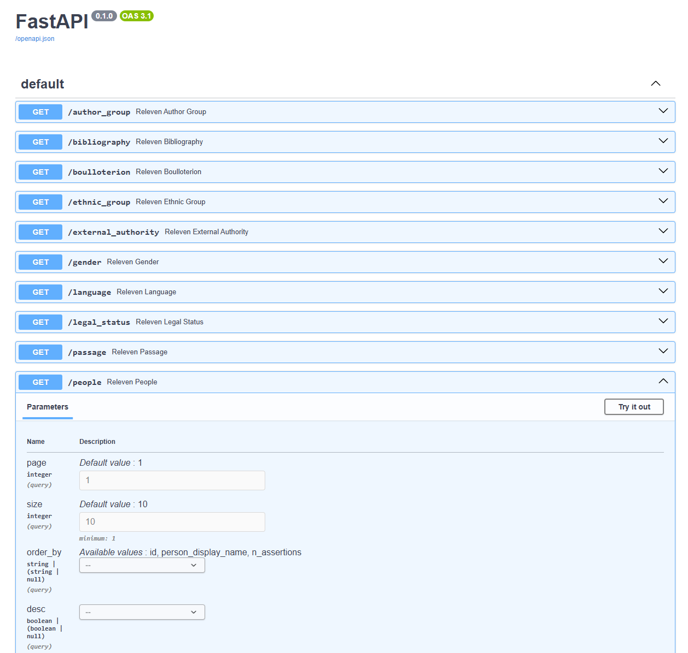

## Motivation

Linked data and knowledge graph technologies are powerful tools for integrating, connecting, and reasoning over complex information from diverse sources. They excel at revealing relationships between entities, supporting semantic search, and powering AI systems with structured context. However, for non-specialist users, the technical representations of triples, ontologies, and graph structures can be difficult to understand and interact with. To make these benefits accessible, simpler, more intuitive data representations—such as tables, visual maps, or natural language interfaces—are often needed to bridge the gap between advanced semantic technologies and everyday users.

We address this problem with `rdfproxy`, a Python library for mapping SPARQL query results to Pydantic models, which allows building REST APIs on top of SPARQL endpoints.

Our particular case study is the ERC project RELEVEN: the aim of RELEVEN is to cast a clearer light on the events of the "short eleventh century" (c. 1030–1095). The key to achieving this is to find a way to link and connect large amounts of disparate sorts of data about the eleventh century that allows us to incorporate and model different, and even conflicting, perspectives about what the data tell us. The RELEVEN project implements a heavily reified CIDOC-CRM-based knowledge graph to represent historical claims with full contextual provenance.

```
TODO star model graph?
```

## Toolchain: `wisskas` and `rdfproxy`

The STAR model is complex, so writing the individual (highly reified) queries itself is cumbersome. Instead, the `rdfproxy` input (pydantic models and SPARQL queries) are generated from model definitions using the command line tool `wisskas`.

### `wisskas`: from STAR model to Pydantic model and SPARQL query

The full STAR model is represented using the Pathbuilder XML format employed by the [WissKI](https://wiss-ki.eu/) virtual research environment. The `wisskas` command line tool allows to filter the complex graph relationships encoded in the model, and derive limited, hierarchical models using a simple filter language.

```bash
git clone https://github.com/erc-releven/releven-backend.git
./generate-endpoints.sh
```

Output:

```
TODO simple example model
```

```
TODO matching query
```

### `rdfproxy`: from Pydantic model and SPARQL query to REST endpoint

Running

```bash
uv run fastapi dev releven.py
```

deploys a [fully functioning REST interface with FastAPI documentation](https://releven-backend.acdh-ch-dev.oeaw.ac.at/docs):



## Acknowledgments

rdfproxy was developed for the ERC project [RELEVEN](https://releven.univie.ac.at/) at the Department of History at the University of Vienna and the [Austrian Centre for Digital Humanities](https://acdh.oeaw.ac.at/) at the Austrian Academy of Sciences.

Poster/demo authors:

- Lukas Plank <lukas.plank@oeaw.ac.at>
- Kevin Stadler <kevin.stadler@oeaw.ac.at>
