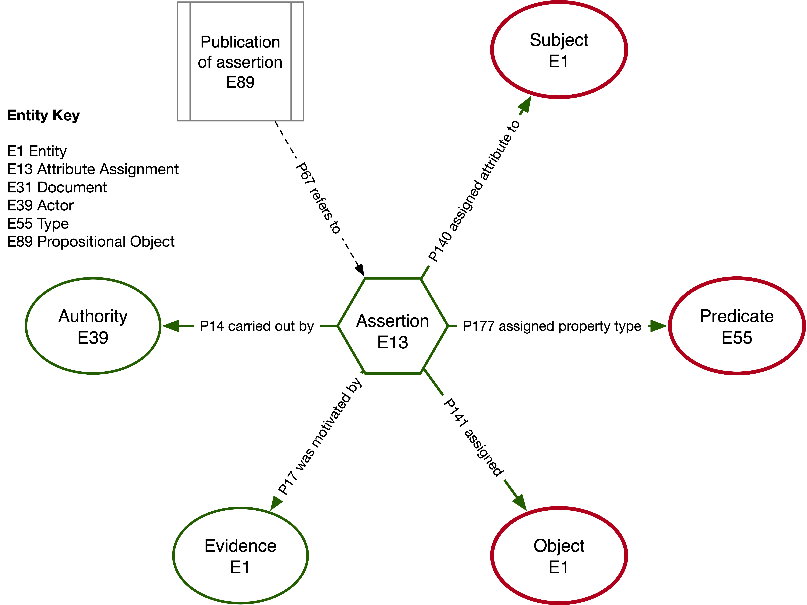

1. TOC
{:toc}

## Motivation

Linked data and knowledge graph technologies are powerful tools for integrating, connecting, and reasoning over complex information from diverse sources. They excel at revealing relationships between entities, supporting semantic search, and powering AI systems with structured context. However, for non-specialist users, the technical representations of triples, ontologies, and graph structures can be difficult to understand and interact with. To make these benefits accessible, simpler, more intuitive data representations—such as tables, visual maps, or natural language interfaces—are often needed to bridge the gap between advanced semantic technologies and everyday users.

We address this problem with [`rdfproxy`](https://github.com/acdh-oeaw/rdfproxy), a Python library for mapping SPARQL query results to Pydantic models, which allows building REST APIs on top of SPARQL endpoints.

Our particular case study is the ERC project [RELEVEN](https://releven.univie.ac.at/): the aim of RELEVEN is to cast a clearer light on the events of the "short eleventh century" (c. 1030–1095). The key to achieving this is to find a way to link and connect large amounts of disparate sorts of data about the eleventh century that allows us to incorporate and model different, and even conflicting, perspectives about what the data tell us. The RELEVEN project implements a heavily reified CIDOC-CRM-based knowledge graph to represent historical claims with full contextual provenance.



## Toolchain demo

The STAR model is complex, so writing the individual (highly reified) queries itself is cumbersome. Instead, the `rdfproxy` input (pydantic models and SPARQL queries) are generated from model definitions using the command line tool `wisskas`.

### `wisskas`: from STAR model to Pydantic model and SPARQL query

The full STAR model is represented using the Pathbuilder XML format employed by the [WissKI](https://wiss-ki.eu/) virtual research environment. The `wisskas` command line tool allows to filter the complex graph relationships encoded in the model, and derive limited, hierarchical models using a simple filter language.

```bash
git clone https://github.com/erc-releven/releven-backend.git
uv run wisskas "releven.xml" endpoints \
  -p crm "http://www.cidoc-crm.org/cidoc-crm/" \
  -p lrmoo "http://iflastandards.info/ns/lrm/lrmoo/" \
  -p rdfschema "http://www.w3.org/2000/01/rdf-schema#" \
  -p star "https://r11.eu/ns/star/" \
  -c -0 \
  -li person person_display_name person_id_assignment.* person_id_assignment_identifier.person_id_assignment_identifier_plain person_possession_assertion#
```

Example output:

```py
from pydantic import AnyUrl, BaseModel, Field
from rdfproxy import ConfigDict

class IdentityInOtherServices(BaseModel):
    person_id_assignment_identifier: AnyUrl
    person_id_assignment_external_authority: AnyUrl

class Person(BaseModel):
    model_config = ConfigDict(
        group_by="person",
    )
    # basic type validation
    person: AnyUrl

    # advanced Pydantic validation constraints
    person_display_name: str = Field(min_length=3)

    # automatic list aggregation based on the binding of
    # the 'group_by' variable specified above
    person_id_assignment: list[IdentityInOtherServices]

    # count of linked entities computed in query
    person_possession_assertion: int
```

```sparql
PREFIX crm: <http://www.cidoc-crm.org/cidoc-crm/>
PREFIX lrmoo: <http://iflastandards.info/ns/lrm/lrmoo/>
PREFIX rdfschema: <http://www.w3.org/2000/01/rdf-schema#>
PREFIX star: <https://r11.eu/ns/star/>


SELECT
  ?person
    ?person_display_name
    ?person_id_assignment
      ?person_id_assignment_identifier
      ?person_id_assignment_external_authority
    ?person_possession_assertion

WHERE {

  ?person a crm:E21_Person .

  OPTIONAL {
    ?person rdfschema:label ?person_display_name .
  }

  OPTIONAL {
    ?person ^crm:P140_assigned_attribute_to ?person_id_assignment .
    ?person_id_assignment a crm:E15_Identifier_Assignment .

    OPTIONAL {
      ?person_id_assignment crm:P37_assigned ?person_id_assignment_identifier .
      ?person_id_assignment_identifier a crm:E42_Identifier .
    }

    OPTIONAL {
      ?person_id_assignment crm:P14_carried_out_by ?person_id_assignment_external_authority .
      ?person_id_assignment_external_authority a lrmoo:F11_Corporate_Body .
    }
  }
  OPTIONAL { SELECT (COUNT(?person_possession_assertion) AS ?person_possession_assertion_count) ?person WHERE {
      ?person ^crm:P141_assigned ?Person_person_possession_assertion .
      ?person_person_possession_assertion a star:E13_crm_P51 .
  } GROUP BY ?Person }
  BIND (COALESCE(?person_possession_assertion_count, 0) AS ?person_possession_assertion)
}
```

### `rdfproxy`: from Pydantic model and SPARQL query to REST endpoint

Running

```bash
uv run fastapi dev releven.py
```

deploys a [fully functioning REST interface with FastAPI documentation](https://releven-backend.acdh-ch-dev.oeaw.ac.at/docs):


### Consuming application

Calls to the REST API are translated into SPARQL queries, their results reassembled into hierarchical models before being serialized. To reduce query load on the triple store, it can be advisable to add caching between the REST API and the consuming applications. In the case of modern web frameworks such as Next, caching can be enabled easily on both the server side as well as on the client, as is the case for the search frontend of the RELEVEN project:

<https://releven.acdh-ch-dev.oeaw.ac.at/en/search>

## Acknowledgments

`rdfproxy`, `wisskas` and the STAR model were developed as part of the ERC project [RELEVEN](https://releven.univie.ac.at/) at the Department of History at the University of Vienna and the [Austrian Centre for Digital Humanities](https://acdh.oeaw.ac.at/) at the Austrian Academy of Sciences.

Poster/demo authors:

- Lukas Plank <lukas.plank@oeaw.ac.at>
- Kevin Stadler <kevin.stadler@oeaw.ac.at>


